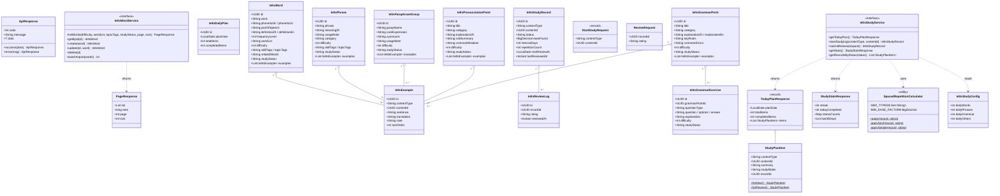

# 类图

> Controller → Service → Mapper 三层结构；`SpacedRepetitionCalculator` 封装 SM-2 算法；内容 Model 持有 `examples` 列表

```mermaid
classDiagram

    %% ─── 公共 DTO ─────────────────────────────────────────
    class ApiResponse {
        +int code
        +String message
        +T data
        +success(data) ApiResponse
        +error(msg) ApiResponse
    }

    class PageResponse {
        +List list
        +long total
        +int page
        +int size
    }

    %% ─── 共享 Model ───────────────────────────────────────
    class IeltsExample {
        +UUID id
        +String contentType
        +UUID contentId
        +String sentence
        +String translation
        +String note
        +int sortOrder
    }

    class IeltsStudyRecord {
        +UUID id
        +String contentType
        +UUID contentId
        +String status
        +BigDecimal easeFactor
        +int intervalDays
        +int repetitionCount
        +LocalDate nextReviewAt
        +Instant lastReviewedAt
    }

    class IeltsReviewLog {
        +UUID id
        +UUID recordId
        +String rating
        +Instant reviewedAt
    }

    class IeltsDailyPlan {
        +UUID id
        +LocalDate planDate
        +int totalItems
        +int completedItems
    }

    %% ─── 内容 Model（持有 examples） ─────────────────────
    class IeltsWord {
        +UUID id
        +String word
        +String phoneticUk / phoneticUs
        +String partOfSpeech
        +String definitionZh / definitionEn
        +int frequencyLevel
        +String wordList
        +int difficulty
        +String skillTags / topicTags
        +String relatedWords
        +String studyStatus
        +List~IeltsExample~ examples
    }

    class IeltsPhrase {
        +UUID id
        +String phrase
        +String meaningZh
        +String usageNote
        +String category
        +int difficulty
        +String skillTags / topicTags
        +String studyStatus
        +List~IeltsExample~ examples
    }

    class IeltsParaphraseGroup {
        +UUID id
        +String groupName
        +String coreExpression
        +String synonyms
        +String usageNote
        +int difficulty
        +String studyStatus
        +List~IeltsExample~ examples
    }

    class IeltsPronunciationPoint {
        +UUID id
        +String title
        +String category
        +String explanationZh
        +String ruleSummary
        +String commonMistakes
        +int difficulty
        +String studyStatus
        +List~IeltsExample~ examples
    }

    class IeltsGrammarPoint {
        +UUID id
        +String title
        +String category
        +String explanationZh / explanationEn
        +String keyRules
        +String commonErrors
        +int difficulty
        +String studyStatus
        +List~IeltsExample~ examples
    }

    class IeltsGrammarExercise {
        +UUID id
        +UUID grammarPointId
        +String questionType
        +String question / options / answer
        +String explanation
        +int difficulty
        +String studyStatus
    }

    %% ─── 学习 DTO ─────────────────────────────────────────
    class TodayPlanResponse {
        <<record>>
        +LocalDate planDate
        +int totalItems
        +int completedItems
        +List~StudyPlanItem~ items
    }

    class StudyPlanItem {
        +String contentType
        +UUID contentId
        +String summary
        +String studyMode
        +UUID recordId
        +forNew()$ StudyPlanItem
        +forReview()$ StudyPlanItem
    }

    class StartStudyRequest {
        <<record>>
        +String contentType
        +UUID contentId
    }

    class ReviewRequest {
        +UUID recordId
        +String rating
    }

    class StudyStatsResponse {
        +int streak
        +int todayCompleted
        +Map statusCounts
        +List last30Days
    }

    %% ─── Service 接口 ─────────────────────────────────────
    class IeltsStudyService {
        <<interface>>
        +getTodayPlan() TodayPlanResponse
        +startStudying(contentType, contentId) IeltsStudyRecord
        +submitReview(request) IeltsStudyRecord
        +getStats() StudyStatsResponse
        +getRecordsByStatus(status) List~StudyPlanItem~
    }

    class IeltsWordService {
        <<interface>>
        +listWords(difficulty, wordList, topicTags, studyStatus, page, size) PageResponse
        +getById(id) IeltsWord
        +create(word) IeltsWord
        +update(id, word) IeltsWord
        +delete(id)
        +batchImport(words) int
    }

    %% ─── SM-2 算法 ────────────────────────────────────────
    class SpacedRepetitionCalculator {
        <<utility>>
        -SM2_TYPES$ Set~String~
        -MIN_EASE_FACTOR$ BigDecimal
        +apply(record, rating)$
        -applySm2(record, rating)$
        -applySimple(record, rating)$
    }

    %% ─── Config ───────────────────────────────────────────
    class IeltsStudyConfig {
        +int dailyWords
        +int dailyPhrases
        +int dailyGrammar
        +int dailyOthers
    }

    %% ─── 关联 ─────────────────────────────────────────────
    IeltsWord              "1" o-- "0..*" IeltsExample
    IeltsPhrase            "1" o-- "0..*" IeltsExample
    IeltsParaphraseGroup   "1" o-- "0..*" IeltsExample
    IeltsPronunciationPoint "1" o-- "0..*" IeltsExample
    IeltsGrammarPoint      "1" o-- "0..*" IeltsExample
    IeltsGrammarPoint      "1" o-- "0..*" IeltsGrammarExercise

    IeltsStudyRecord       "1" o-- "0..*" IeltsReviewLog

    TodayPlanResponse      o-- StudyPlanItem

    IeltsStudyService ..> SpacedRepetitionCalculator : uses
    IeltsStudyService ..> IeltsStudyConfig            : reads
    IeltsStudyService ..> TodayPlanResponse           : returns
    IeltsStudyService ..> StudyStatsResponse          : returns
    IeltsWordService  ..> PageResponse                : returns
```
