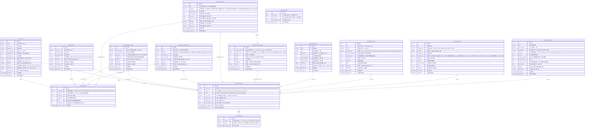

# 数据库表结构 ER 图

> 14 张表，统一存入 `enterprise_kb` 库；`ielts_examples` 和 `ielts_study_records` 通过 `(content_type, content_id)` 多态关联内容表，无物理外键

```mermaid
erDiagram

    %% ─── 跨技能内容（Cross-skill） ──────────────────────────
    ielts_words {
        uuid     id             PK  "主键"
        varchar  word              "单词原形 UNIQUE"
        varchar  phonetic_uk       "英式音标"
        varchar  phonetic_us       "美式音标"
        varchar  part_of_speech    "词性：n./v./adj. 等"
        text     definition_zh     "中文释义，多义词换行分隔"
        text     definition_en     "英文释义"
        smallint frequency_level   "雅思出现频率 1-5，5最高，默认3"
        varchar  word_list         "词表来源：AWL / GSL / IELTS"
        smallint difficulty        "难度：1基础 2中级 3高级，默认2"
        varchar  skill_tags        "适用技能，逗号分隔：listening,reading,writing,speaking"
        varchar  topic_tags        "话题标签，逗号分隔：environment,health 等"
        text     related_words     "近义词/关联词，换行分隔"
        timestamptz created_at     "创建时间"
        timestamptz updated_at     "最后更新时间"
    }

    ielts_phrases {
        uuid     id             PK  "主键"
        varchar  phrase            "短语原文 UNIQUE"
        text     meaning_zh        "中文含义"
        text     usage_note        "用法说明"
        varchar  category          "短语类型：signal-word/sentence-frame/collocation/connector/idiom"
        smallint difficulty        "难度：1基础 2中级 3高级，默认2"
        varchar  skill_tags        "适用技能，逗号分隔"
        varchar  topic_tags        "话题标签，逗号分隔"
        timestamptz created_at     "创建时间"
        timestamptz updated_at     "最后更新时间"
    }

    ielts_paraphrase_groups {
        uuid     id             PK  "主键"
        varchar  group_name        "组名，通常为核心概念，如 increase"
        varchar  core_expression   "核心表达词或短语"
        text     synonyms          "全部同义替换词/短语，每行一条，可含词性标注"
        text     usage_note        "用法区别说明：语境/正式程度/搭配差异等"
        smallint difficulty        "难度：1基础 2中级 3高级，默认2"
        varchar  skill_tags        "适用技能，逗号分隔"
        varchar  topic_tags        "话题标签，逗号分隔"
        timestamptz created_at     "创建时间"
        timestamptz updated_at     "最后更新时间"
    }

    %% ─── 听力 / 口语 ──────────────────────────────────────
    ielts_pronunciation_points {
        uuid     id             PK  "主键"
        varchar  title             "要点标题，如：辅音+元音连读规则"
        varchar  category          "发音类型：stress重音/linking连读/weak-form弱读/intonation语调/elision省音/assimilation同化"
        text     explanation_zh    "中文讲解"
        text     rule_summary      "规则要点，换行分隔"
        text     common_mistakes   "中国学习者常见错误及纠正，换行分隔"
        varchar  skill_tags        "适用技能：listening,speaking"
        smallint difficulty        "难度：1基础 2中级 3高级，默认2"
        timestamptz created_at     "创建时间"
        timestamptz updated_at     "最后更新时间"
    }

    ielts_speaking_topics {
        uuid     id             PK  "主键"
        varchar  title             "话题标题"
        smallint part              "口语考试部分：1/2/3"
        text     question          "具体问题，Part 2 为完整 Cue Card"
        text     reference_answer  "参考答案思路或范例"
        text     key_vocabulary    "话题高分词汇，换行分隔"
        text     useful_phrases    "话题常用句式，换行分隔"
        smallint difficulty        "难度：1基础 2中级 3高级，默认2"
        varchar  topic_tags        "话题标签，逗号分隔：lifestyle,technology 等"
        timestamptz created_at     "创建时间"
        timestamptz updated_at     "最后更新时间"
    }

    ielts_listening_items {
        uuid     id             PK  "主键"
        varchar  title             "练习标题，如：机场问询 Section 1"
        smallint section           "雅思听力 Section 编号：1-4"
        varchar  question_type     "题型：form-completion/note-completion/table-completion/multiple-choice/matching/map-labelling/flow-chart"
        text     context_description "听力场景描述：谁在哪里说什么"
        text     script_excerpt    "关键脚本片段，含信号词和答案位置提示"
        text     questions         "题目，换行分隔"
        text     answers           "答案及解析"
        text     tips              "该题型专项作答技巧"
        smallint difficulty        "难度：1基础 2中级 3高级，默认2"
        varchar  topic_tags        "话题标签，逗号分隔"
        timestamptz created_at     "创建时间"
        timestamptz updated_at     "最后更新时间"
    }

    %% ─── 写作 / 语法 ──────────────────────────────────────
    ielts_grammar_points {
        uuid     id             PK  "主键"
        varchar  title             "语法要点标题，如：现在完成时的用法"
        varchar  category          "语法分类：tense时态/conditional条件句/passive被动/relative-clause定语从句/modal情态/comparison比较/article冠词/sentence-structure句型"
        text     explanation_zh    "中文讲解"
        text     explanation_en    "英文讲解，适合对照学习"
        text     key_rules         "核心规则提炼，换行分隔"
        text     common_errors     "中国学习者常见错误及纠正，换行分隔"
        smallint difficulty        "难度：1基础 2中级 3高级，默认2"
        varchar  skill_tags        "适用技能：writing,speaking"
        varchar  topic_tags        "相关话题标签，逗号分隔"
        timestamptz created_at     "创建时间"
        timestamptz updated_at     "最后更新时间"
    }

    ielts_grammar_exercises {
        uuid     id             PK  "主键"
        uuid     grammar_point_id  "关联语法要点 FK → ielts_grammar_points，null 表示综合练习"
        varchar  question_type     "题型：fill-in-blank填空/error-correction改错/sentence-transformation句子转换/multiple-choice选择"
        text     question          "题目，含说明和句子"
        text     options           "选项，仅 multiple-choice 有效，换行分隔"
        text     answer            "标准答案"
        text     explanation       "解析：说明为什么对/错及关联规则"
        smallint difficulty        "难度：1基础 2中级 3高级，默认2"
        timestamptz created_at     "创建时间"
        timestamptz updated_at     "最后更新时间"
    }

    ielts_writing_tasks {
        uuid     id             PK  "主键"
        varchar  title             "题目简短描述"
        smallint task_number       "Task 编号：1 或 2"
        varchar  training_type     "考试类型：ACADEMIC 学术 / GENERAL 培训"
        varchar  task_type         "题目细分类型：Task1 bar-chart/line-graph/pie-chart/table/diagram/map/letter，Task2 argument/discussion/problem-solution/two-part"
        text     prompt            "完整题目要求原文"
        text     image_description "Task 1 图表数据文字还原，供无图参考"
        text     model_answer      "范文"
        text     band_score_note   "高分答案评分要点：词汇/连贯/语法/任务回应"
        text     key_phrases       "该题型常用句式，换行分隔"
        smallint difficulty        "难度：1基础 2中级 3高级，默认2"
        varchar  topic_tags        "话题标签，逗号分隔"
        timestamptz created_at     "创建时间"
        timestamptz updated_at     "最后更新时间"
    }

    ielts_reading_items {
        uuid     id             PK  "主键"
        varchar  title             "文章标题"
        varchar  training_type     "考试类型：ACADEMIC 学术 / GENERAL 培训，默认 ACADEMIC"
        smallint difficulty        "难度：1基础 2中级 3高级，默认2"
        text     passage_text      "文章正文"
        varchar  question_type     "题型：tfng判断题/ynng是否题/matching-headings段落标题匹配/matching-info信息匹配/sentence-completion句子填空/multiple-choice选择/summary-completion摘要填空/short-answer简答"
        text     questions         "题目，换行分隔"
        text     answers           "答案及定位解析"
        text     key_vocabulary    "文章核心词汇及释义"
        text     tips              "该题型阅读技巧"
        varchar  topic_tags        "话题标签，逗号分隔"
        timestamptz created_at     "创建时间"
        timestamptz updated_at     "最后更新时间"
    }

    %% ─── 共享辅助表 ──────────────────────────────────────
    ielts_examples {
        uuid     id             PK  "主键"
        varchar  content_type      "所属内容类型：WORD/PHRASE/PARAPHRASE/PRONUNCIATION/GRAMMAR_POINT  idx(content_type,content_id)"
        uuid     content_id        "对应内容表主键，与 content_type 组合定位具体记录"
        text     sentence          "例句（英文）或原句"
        text     translation       "例句中文翻译或改写句"
        text     note              "补充说明，如语境限制或用法提示"
        int      sort_order        "展示排序，同一内容多例句时生效，默认0"
        timestamptz created_at     "创建时间"
    }

    %% ─── 学习记录 ────────────────────────────────────────
    ielts_study_records {
        uuid     id             PK  "主键"
        varchar  content_type      "内容类型：WORD/PHRASE/PARAPHRASE/PRONUNCIATION/GRAMMAR_POINT/GRAMMAR_EXERCISE/SPEAKING/LISTENING/READING/WRITING"
        uuid     content_id        "对应内容主键，UNIQUE(content_type,content_id)  idx(next_review_at,status)"
        varchar  status            "学习状态：LEARNING学习中 / REVIEWING复习中 / MASTERED已掌握"
        decimal  ease_factor       "SM-2 难易系数，初始2.50，WORD/PHRASE 专用"
        int      interval_days     "当前复习间隔天数，默认1"
        int      repetition_count  "累计复习次数，默认0"
        date     next_review_at    "下次复习日期，由 SM-2 算法计算"
        timestamptz last_reviewed_at "最后一次复习时间"
        timestamptz created_at     "首次加入学习的时间"
    }

    ielts_review_logs {
        uuid     id             PK  "主键"
        uuid     record_id         "关联学习记录 FK → ielts_study_records ON DELETE CASCADE"
        varchar  rating            "本次评分：AGAIN忘了 / HARD困难 / GOOD良好 / EASY简单"
        timestamptz reviewed_at    "本次复习时间"
    }

    ielts_daily_plans {
        uuid     id             PK  "主键"
        date     plan_date         "计划日期 UNIQUE，每天至多一条"
        int      total_items       "今日计划学习总数（到期复习 + 补充新内容）"
        int      completed_items   "已完成数，默认0"
        timestamptz generated_at   "计划生成时间"
    }

    %% ─── 关联（物理 FK）─────────────────────────────────
    ielts_grammar_points    ||--o{ ielts_grammar_exercises : "含练习"
    ielts_study_records     ||--o{ ielts_review_logs       : "复习日志"

    %% ─── 逻辑关联（多态，无物理 FK）────────────────────
    ielts_words             ||--o{ ielts_examples          : "WORD"
    ielts_phrases           ||--o{ ielts_examples          : "PHRASE"
    ielts_paraphrase_groups ||--o{ ielts_examples          : "PARAPHRASE"
    ielts_pronunciation_points ||--o{ ielts_examples       : "PRONUNCIATION"
    ielts_grammar_points    ||--o{ ielts_examples          : "GRAMMAR_POINT"

    ielts_words             ||--o| ielts_study_records     : "WORD"
    ielts_phrases           ||--o| ielts_study_records     : "PHRASE"
    ielts_paraphrase_groups ||--o| ielts_study_records     : "PARAPHRASE"
    ielts_pronunciation_points ||--o| ielts_study_records  : "PRONUNCIATION"
    ielts_grammar_points    ||--o| ielts_study_records     : "GRAMMAR_POINT"
    ielts_grammar_exercises ||--o| ielts_study_records     : "GRAMMAR_EXERCISE"
    ielts_speaking_topics   ||--o| ielts_study_records     : "SPEAKING"
    ielts_listening_items   ||--o| ielts_study_records     : "LISTENING"
    ielts_reading_items     ||--o| ielts_study_records     : "READING"
    ielts_writing_tasks     ||--o| ielts_study_records     : "WRITING"
```
