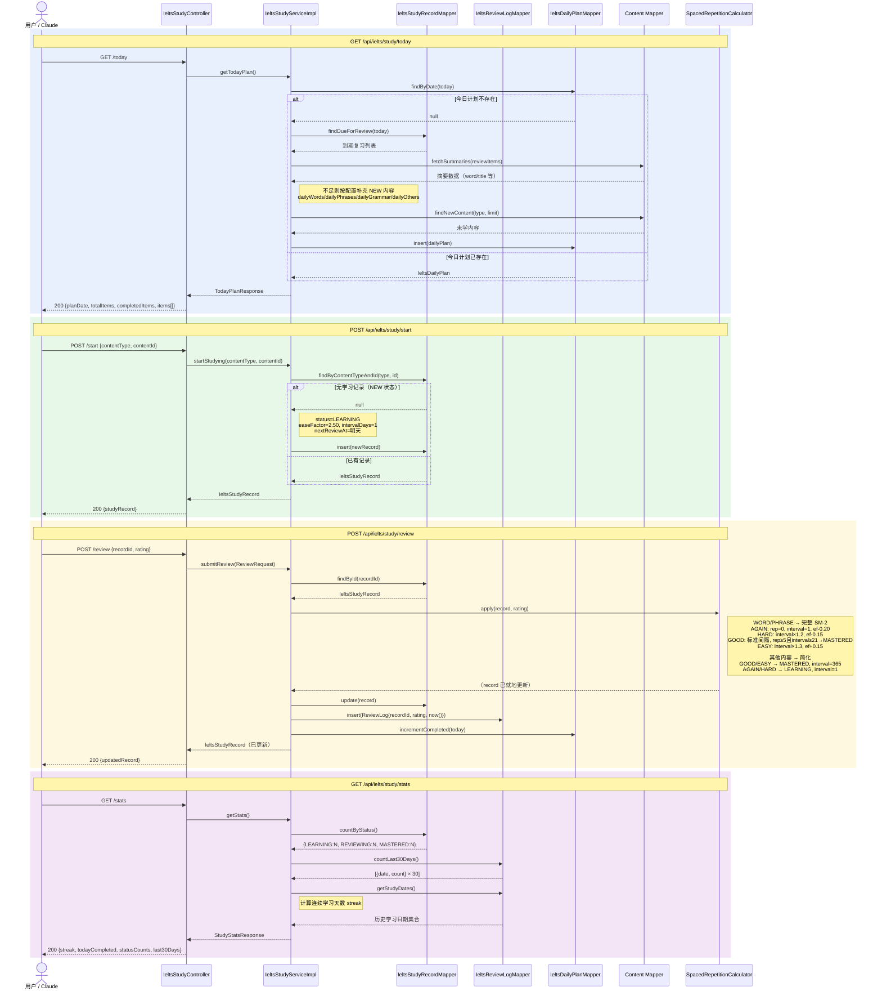

# 学习流程时序图

> 覆盖四个核心接口：获取今日计划 → 开始学习 → 提交复习 → 查看统计

```mermaid
sequenceDiagram
    actor       User      as 用户 / Claude
    participant Ctrl      as IeltsStudyController
    participant Svc       as IeltsStudyServiceImpl
    participant RecMapper as IeltsStudyRecordMapper
    participant LogMapper as IeltsReviewLogMapper
    participant PlanMapper as IeltsDailyPlanMapper
    participant CMapper   as Content Mapper
    participant SM2       as SpacedRepetitionCalculator

    %% ─── 1. 获取今日学习计划 ──────────────────────────────
    rect rgb(232, 240, 254)
        Note over User,SM2: GET /api/ielts/study/today

        User  ->> Ctrl      : GET /today
        Ctrl  ->> Svc       : getTodayPlan()
        Svc   ->> PlanMapper: findByDate(today)

        alt 今日计划不存在
            PlanMapper -->> Svc : null
            Svc  ->> RecMapper  : findDueForReview(today)
            RecMapper -->> Svc  : 到期复习列表
            Svc  ->> CMapper    : fetchSummaries(reviewItems)
            CMapper -->> Svc    : 摘要数据（word/title 等）
            Note right of Svc   : 不足则按配置补充 NEW 内容<br/>dailyWords/dailyPhrases/dailyGrammar/dailyOthers
            Svc  ->> CMapper    : findNewContent(type, limit)
            CMapper -->> Svc    : 未学内容
            Svc  ->> PlanMapper : insert(dailyPlan)
        else 今日计划已存在
            PlanMapper -->> Svc : IeltsDailyPlan
        end

        Svc  -->> Ctrl      : TodayPlanResponse
        Ctrl -->> User      : 200 {planDate, totalItems, completedItems, items[]}
    end

    %% ─── 2. 开始学习 NEW 内容 ─────────────────────────────
    rect rgb(232, 248, 232)
        Note over User,SM2: POST /api/ielts/study/start

        User  ->> Ctrl      : POST /start {contentType, contentId}
        Ctrl  ->> Svc       : startStudying(contentType, contentId)
        Svc   ->> RecMapper : findByContentTypeAndId(type, id)

        alt 无学习记录（NEW 状态）
            RecMapper -->> Svc : null
            Note right of Svc  : status=LEARNING<br/>easeFactor=2.50, intervalDays=1<br/>nextReviewAt=明天
            Svc  ->> RecMapper : insert(newRecord)
        else 已有记录
            RecMapper -->> Svc : IeltsStudyRecord
        end

        Svc  -->> Ctrl      : IeltsStudyRecord
        Ctrl -->> User      : 200 {studyRecord}
    end

    %% ─── 3. 提交复习评分 ──────────────────────────────────
    rect rgb(255, 248, 225)
        Note over User,SM2: POST /api/ielts/study/review

        User  ->> Ctrl      : POST /review {recordId, rating}
        Ctrl  ->> Svc       : submitReview(ReviewRequest)
        Svc   ->> RecMapper : findById(recordId)
        RecMapper -->> Svc  : IeltsStudyRecord

        Svc   ->> SM2       : apply(record, rating)
        Note right of SM2   : WORD/PHRASE → 完整 SM-2<br/>  AGAIN: rep=0, interval=1, ef-0.20<br/>  HARD:  interval×1.2,  ef-0.15<br/>  GOOD:  标准间隔,  rep≥5且interval≥21→MASTERED<br/>  EASY:  interval×1.3, ef+0.15<br/><br/>其他内容 → 简化<br/>  GOOD/EASY → MASTERED, interval=365<br/>  AGAIN/HARD → LEARNING, interval=1
        SM2   -->> Svc      : （record 已就地更新）

        Svc   ->> RecMapper : update(record)
        Svc   ->> LogMapper : insert(ReviewLog{recordId, rating, now()})
        Svc   ->> PlanMapper: incrementCompleted(today)

        Svc  -->> Ctrl      : IeltsStudyRecord（已更新）
        Ctrl -->> User      : 200 {updatedRecord}
    end

    %% ─── 4. 查看学习统计 ──────────────────────────────────
    rect rgb(243, 229, 245)
        Note over User,SM2: GET /api/ielts/study/stats

        User  ->> Ctrl      : GET /stats
        Ctrl  ->> Svc       : getStats()

        Svc   ->> RecMapper : countByStatus()
        RecMapper -->> Svc  : {LEARNING:N, REVIEWING:N, MASTERED:N}

        Svc   ->> LogMapper : countLast30Days()
        LogMapper -->> Svc  : [{date, count} × 30]

        Svc   ->> LogMapper : getStudyDates()
        Note right of Svc   : 计算连续学习天数 streak
        LogMapper -->> Svc  : 历史学习日期集合

        Svc  -->> Ctrl      : StudyStatsResponse
        Ctrl -->> User      : 200 {streak, todayCompleted, statusCounts, last30Days}
    end
```
